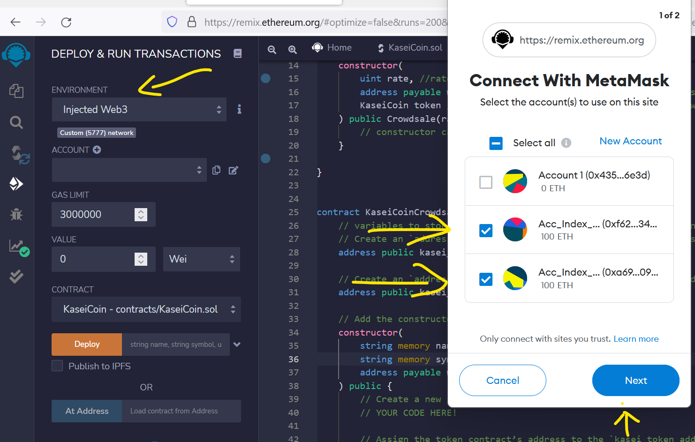

[Technologies](#Technologies) | [Installation](#installation-guide) | [Usage](#usage) | [Evaluation Evidence](#evaluation-evidence-section) | [GIF Recordings](#gifrecordings) | [Contributors](#contributors) | [License](#license) | [Detailed Instructions](#detailedinstructions) 

# joint_savings
This is a blockchain-based smart contract application to create a fungible token that is ERC-20 compliant and that will be minted by using a `Crowdsale` contract from the OpenZeppelin Solidity library. The crowdsale contract will manage the entire crowdsale process, allowing users to send ether to the contract and in return receive KAI, or KaseiCoin tokens. The Smart contract is deployed using Remix, Metamask, Ganashe and Solidity by integrating the Ethereum blockchain network into the application. 

## Technologies

This project leverages solidity ^0.5 along with the following Technologies:

* [Visual Studio Code](https://code.visualstudio.com/?wt.mc_id=DX_841432) - Visual Studio Code is a lightweight but powerful source code editor which runs on your desktop and is available for Windows, macOS and Linux. 

* [Ganache](https://trufflesuite.com/ganache/) - A program that allows you to quickly set up a local blockchain, which you can use to test and develop smart contracts. 

* [REMIX IDE](https://remix-project.org/) - Remix IDE allows developing, deploying and administering smart contracts for Ethereum like blockchains.

* [Solidity](https://docs.soliditylang.org/en/v0.8.14/) - Solidity is an object-oriented, high-level language for implementing smart contracts. Smart contracts are programs which govern the behaviour of accounts within the Ethereum state.


---

## Installation Guide

You will need Solidity version 0.5.0 or above and gitbash/terminal on your computer, along with other supporting packages as mentioned below. 

Please follow instructions from the below link to install python 3.7 or above on your computer

[To install Python, follow instructions from this link](https://www.python.org/downloads/)

[To install Git Bash, follow instructions from this link](https://github.com/git-guides/install-git)

[To install Anaconda, follow instructions from this link ](https://docs.anaconda.com/anaconda/install/)

[To install Visual Studio Code, follow instructions from this link ](https://code.visualstudio.com/docs/setup/setup-overview)

[To install Ganache, follow instructions from this link to download and install ](https://trufflesuite.com/ganache/)

[To install Microsoft Visual C++ Build Tools in Windows(dependency for Web3.py in windows), follow instructions below](https://visualstudio.microsoft.com/downloads/)

    * [Go to](https://visualstudio.microsoft.com/downloads/)
    * Scroll down the page, and then click "Tools for Visual Studio 2019" to reveal the options.
    * Download the "Build Tools for Visual Studio 2019" package.
    * Run the package file and select the C++ Build Tools option. Then click Install. The installation process takes about 15 minutes.


```python
# install conda dev environment and activate it
    conda update conda
    conda create -n dev python=3.7 anaconda
    conda activate dev

# Install Web3.py library (Optional)
    conda activate dev
    pip install web3==5.17

# Install ethereum-tester library (Optional)
    conda activate dev
    pip install eth-tester==0.5.0b3

# Install mnemonic package (Optional)
    conda activate dev
    pip install mnemonic

# Install bip44 package (Optional)
    conda activate dev
    pip install bip44


```

---


## Usage

[Use this Simple Unit Converter for converstion between Ether, Gwei or Wei](https://eth-converter.com/)

To use the KaseiCoin Smart Contract, clone the repository and run the above commands in gitbash as applicable,

```git
git clone https://github.com/sidbetatester/KaseiCoin.git

cd KaseiCoin

# 2. To launch the Remix web IDE, use the following link in the browser

https://remix.ethereum.org/

# 3. On the resulting webpage, Create the .sol file for KaseiCoin.sol and KaseiCoinCrowdsale.sol that you downloaded from github)

# 4. Use 0.5.0 or above Solidity Compiler, click Compile

```

## Evaluation Evidence section 

### 5. Configure a local blockchain with Remix, MetaMask, and Ganache as shown below.


    
    
### 6. In the Deploy & Run Transactions Section, choose 'Injected_Web3 VM' environment, and click 'Deploy'




### 7. Create the KaseiCoin Token Contract


### 8. Create the KaseiCoin Crowdsale Contract


### 9. Create the KaseiCoin Deployer Contract


### 10. Deploy the Crowdsale to a Local Blockchain: Steps to deploy and utilize the KaseiCoin contract

### 1. To deploy the KaseiCoinCrowdsaleDeployer contract
    - Select the KaseiCoinCrowdsaleDeployer contract from the contract dropdown menu and fill in the Deploy Section as shown below; 
        Name: KaseiCoin
        Symbol: KAI 
        Wallet: Any Address, eg: 0xf627E0Ef9ce129E7793080f9Ca3299a48ca934dC or 0xA690DbBAfBD2e8d7ba4e5c1a0e6b7fD32A5209A0
    (wallet that will get paid all of the ether raised by the crowdsale contract)
Click Transact and then Confirm the transaction on the Metamask Wallet pop-up 
The Deployer Contract creates and launches Crowdsale and KaseiCoin contracts 

### 2. To link the Crowdsale Contract, click the Crowdsale contract in the deployment pane and copy the address
    - Select the Crowdsale contract from the contract dropdown menu and paste the address in the 'At Address' Text Bar; 
    - Click 'At Address' and scroll down to see the contract functions

### 3. To link the KaseiCoin Contract, click the KaseiCoin contract in the deployment pane and copy the address
    - Select the KaseiCoin contract from the contract dropdown menu and paste the address in the 'At Address' Text Bar; 
    - Click 'At Address' and scroll down to see the contract functions

### 4. Test the functionality of the crowdsale by using test accounts to buy new tokens and then checking the balances associated with those accounts.
    - 0xf627E0Ef9ce129E7793080f9Ca3299a48ca934dC : 15
    - 0xA690DbBAfBD2e8d7ba4e5c1a0e6b7fD32A5209A0 : 10

### 5. After purchasing tokens with one or more test accounts, view the total supply of minted tokens and the amount of wei 
that has been raised in the crowdsale contract.
    - Total Supply of minted Tokens and the amount of wei raised in crowdsale contract should be 25 in our example
   
## GIF_Recordings


## Contributors

Siddharth Venkumahanti
[linkedin](https://www.linkedin.com/in/siddharthvenkumahanti/)


---


## License

## MIT License

Copyright (c) [2022] [Siddharth Venkumahanti]

Permission is hereby granted, free of charge, to any person obtaining a copy
of this software and associated documentation files (the "Software"), to deal
in the Software without restriction, including without limitation the rights
to use, copy, modify, merge, publish, distribute, sublicense, and/or sell
copies of the Software, and to permit persons to whom the Software is
furnished to do so, subject to the following conditions:

The above copyright notice and this permission notice shall be included in all
copies or substantial portions of the Software.

THE SOFTWARE IS PROVIDED "AS IS", WITHOUT WARRANTY OF ANY KIND, EXPRESS OR
IMPLIED, INCLUDING BUT NOT LIMITED TO THE WARRANTIES OF MERCHANTABILITY,
FITNESS FOR A PARTICULAR PURPOSE AND NONINFRINGEMENT. IN NO EVENT SHALL THE
AUTHORS OR COPYRIGHT HOLDERS BE LIABLE FOR ANY CLAIM, DAMAGES OR OTHER
LIABILITY, WHETHER IN AN ACTION OF CONTRACT, TORT OR OTHERWISE, ARISING FROM,
OUT OF OR IN CONNECTION WITH THE SOFTWARE OR THE USE OR OTHER DEALINGS IN THE
SOFTWARE.


# Detailed_Instructions

## Challenge: Martian Token Crowdsale

You will create a fungible token that is ERC-20 compliant and that will be minted by using a `Crowdsale` contract from the OpenZeppelin Solidity library.

The crowdsale contract that you create will manage the entire crowdsale process, allowing users to send ether to the contract and in return receive KAI, or KaseiCoin tokens. Your contract will mint the tokens automatically and distribute them to buyers in one transaction.

### Instructions

The steps for this Challenge are divided into the following sections:

1. Create the KaseiCoin Token Contract

2. Create the KaseiCoin Crowdsale Contract

3. Create the KaseiCoin Deployer Contract

4. Deploy the Crowdsale to a Local Blockchain

5. Optional: Extend the Crowdsale Contract by Using OpenZeppelin

#### Create the KaseiCoin Token Contract

In this section, you will create a smart contract that defines KaseiCoin as an ERC-20 token. To do so, complete the following steps:

1. Import the provided `KaseiCoin.sol` starter file into the Remix IDE.

2. Import the following contracts from the OpenZeppelin library:

    * `ERC20`

    * `ERC20Detailed`

    * `ERC20Mintable`

3. Define a contract for the KaseiCoin token called `KaseiCoin`, and have the contract inherit the three contracts that you just imported from OpenZeppelin.

4. Inside of your `KaseiCoin` contract, add a constructor with the following parameters: `name`, `symbol`, and `initial_supply`.

5. Then, as part of your constructor definition, add a call to the `ERC20Detailed` contract’s constructor, passing the parameters `name`, `symbol`, and `18`. Recall that 18 is the value for the `decimal` parameter.


6. Compile the contract using compiler version 0.5.0.

7. Check for any errors and debug as needed.

8. Take a screenshot of the successful compilation of the contract, and add it to the Evaluation Evidence section of the `README.md` file for your Challenge repository.

#### Create the KaseiCoin Crowdsale Contract

In this section, you will define the KaseiCoin crowdsale contract. To do so, complete the following steps:

1. Import the provided `KaseiCoinCrowdsale.sol` starter code into the Remix IDE.

2. Have this contract inherit the following OpenZeppelin contracts:

* `Crowdsale`

* `MintedCrowdsale`

3. Within the `KaisenCoinCrowdsale` constructor, provide parameters for all of the features of your crowdsale, such as `rate`, `wallet` (where the funds that the token raises should be deposited), and `token`. Configure these parameters as you see fit for your KaseiCoin token.

4. Compile the contract using compiler version 0.5.0.

5. Check for any errors and debug as needed.

6. Take a screenshot of the successful compilation of the contract, and add it to the Evaluation Evidence section of the `README.md` file for your Challenge repository.

#### Create the KaseiCoin Deployer Contract


In this section, you will create the KaseiCoin deployer contract. Start by uncommenting the `KaseiCoinCrowdsaleDeployer` contract in the provided `KaseiCoinCrowdsale.sol` starter code.

Next, within the `KaseiCoinCrowdsaleDeployer` contract, add variables to store the addresses of the `KaseiCoin` and `KaseiCoinCrowdsale` contracts, which this contract will deploy. To do so, complete the following steps:

1. Create an `address public` variable called `kasei_token_address`, which will store `KaseiCoin`’s address once that contract has been deployed.

2. Create an `address public` variable called `kasei_crowdsale_address`, which will store `KaseiCoinCrowdsale`'s address once that contract has been deployed.

3. Add the following parameters to the constructor for the `KaseiCoinCrowdsaleDeployer` contract: `name`, `symbol`, and `wallet`.

4. Inside of the constructor body (between the curly braces), complete the following steps:

    * Create a new instance of the `KaseiCoinToken` contract.

    * Assign the KaseiCoin token contract’s address to the `kasei_token_address` variable. This will allow you to easily fetch the token's address later.

    * Create a new instance of the `KaseiCoinCrowdsale` contract using the following parameters:

       * `rate` (Set `rate` equal to 1 in order to maintain parity with ether.)

       * `wallet` (Pass `wallet` in from the main constructor. This is the wallet that will get paid all of the ether raised by the crowdsale contract.)

       * `token` (This should be the `token` variable where `KaseiCoin` is stored.)

    * Assign the KaseiCoin crowdsale contract’s address to the `kasei_crowdsale_address` variable. This will allow you to easily fetch the crowdsale’s address later.

    * Set the `KaseiCoinCrowdsale` contract as a minter.

    * Have the `KaseiCoinCrowdsaleDeployer` renounce its minter role.

5. Compile the contract using compiler version 0.5.0.

6. Check for any errors and debug as needed.

7. Take a screenshot of the successful compilation of the contract, and add it to the Evaluation Evidence section of the `README.md` file for your Challenge repository.

#### Deploy the Crowdsale to a Local Blockchain

In this section, you will deploy the crowdsale to a local blockchain using Remix, MetaMask, and Ganache. To do so, complete the following steps. Record a short video or take screenshots that illustrate the three steps outlined below as evidence of your deployed crowdsale contract.


1. Deploy the crowdsale to a local blockchain with Remix, MetaMask, and Ganache.

2. Test the functionality of the crowdsale by using test accounts to buy new tokens and then checking the balances associated with those accounts.

3. After purchasing tokens with one or more test accounts, view the total supply of minted tokens and the amount of wei that has been raised in the crowdsale contract.

#### Optional: Extend the Crowdsale Contract by Using OpenZeppelin

In this **optional** section, you may extend the crowdsale contract to enhance its functionality. To do so, you will use the following OpenZeppelin contracts:

* `CappedCrowdsale`: This contract allows you to cap the total amount of ether that may be raised during your crowdsale.

* `TimedCrowdsale`: This contract allows you to set a time limit for your crowdsale by adding an opening time and a closing time.

* `RefundablePostDeliveryCrowdsale`: Every time you launch a crowdsale, you set a goal amount of ether to raise. If the goal is not reached, it is common practice to refund your investors. This contract adds this capability to a crowdsale.

> **Hint** We encourage you to read more about these contracts on the [Crowdsales page](https://docs.openzeppelin.com/contracts/2.x/crowdsales) of the OpenZeppelin documentation.

To enhance your KaseiCoin crowdsale with this added functionality, complete the following steps:

1. Import the three OpenZeppelin contracts described above into the `KaseiCoinCrowdsale.sol` contract by using the following code:

    ```solidity
    import "https://github.com/OpenZeppelin/openzeppelin-contracts/blob/release-v2.5.0/contracts/crowdsale/validation/CappedCrowdsale.sol";
    import "https://github.com/OpenZeppelin/openzeppelin-contracts/blob/release-v2.5.0/contracts/crowdsale/validation/TimedCrowdsale.sol";
    import "https://github.com/OpenZeppelin/openzeppelin-contracts/blob/release-v2.5.0/contracts/crowdsale/distribution/RefundablePostDeliveryCrowdsale.sol";
    ```

2. In addition to the `Crowdsale` and `MintedCrowdsale` contracts, which your contract previously inherited from OpenZeppelin, have your `KaseiCoinCrowdsale` contract inherit the three contracts that you imported in the previous step:

* `CappedCrowdsale`

* `TimedCrowdsale`

* `RefundablePostDeliveryCrowdsale`

3. In the `KaseiCoinCrowdsale` constructor, add the following new parameters:

    * `uint goal`: This variable will represent the amount of ether which you hope to raise during the crowdsale&mdash;the crowdsale’s goal.

    * `uint open`: This variable will represent the opening time for the crowdsale.

    * `uint close`: This variable will represent the closing time for the crowdsale.

4. Complete the `KaseiCoinCrowdsale` constructor code by adding calls to the new contracts, as the following code shows:

    ```solidity
    constructor(
            uint256 rate, // rate in TKNbits
            address payable wallet, // sale beneficiary
            KaseiCoin token, // the KaseiCoin itself that the KaseiCoinCrowdsale will work with
            uint goal, // the crowdsale goal
            uint open, // the crowdsale opening time
            uint close // the crowdsale closing time
        ) public
            Crowdsale(rate, wallet, token)
            CappedCrowdsale(goal)
            TimedCrowdsale(open, close)
            RefundableCrowdsale(goal)
        {
            // constructor can stay empty
        }
    ```

    > **Important** `RefundablePostDeliveryCrowdsale` itself inherits the `RefundableCrowdsale` contract, which requires a `goal` parameter. So, in addition to the others, you must call the `RefundableCrowdsale` constructor from your `KaseiCoinCrowdsale` constructor. `RefundablePostDeliveryCrowdsale` does not have its own constructor, which is why we use the `RefundableCrowdsale` constructor that it inherits.
    >
    > If you forget to call the `RefundableCrowdsale` constructor, the `RefundablePostDeliveryCrowdsale` will fail. This is because it does not have its own constructor, and so it relies on the `RefundableCrowdsale` constructor.

5. Next, update the `KaseiCoinCrowdsaleDeployer` contract to allow the deployment of the updated crowdsale contract. In the constructor of the deployer contract, add a new `uint` parameter called `goal` that will allow you to set the crowdsale goal.

6. In the core assignment, you added an instance of the `KaseiCoinCrowdsale` contract to the KaseiCoin deployer contract. Since we have modified the `KaseiCoinCrowdsale` contract to support new functionality, you must now update your previous code with the following code:

    ```solidity
    KaseiCoinCrowdsale kasei_crowdsale = new KaseiCoinCrowdsale (1, wallet, token, goal, now, now + 24 weeks);
    ```

   Note that in the preceding code, you added values for the three new parameters. The `goal` parameter represents the amount of ether to raise during the crowdsale, `now` represents the crowdsale opening time, and `now + 24 weeks` represents the closing time.

    The `now` function returns the current Ethereum block timestamp in the form of seconds since the Unix epoch. The **Unix epoch** (also known as **Unix time**, **POSIX time**, or **Unix timestamp**) is an integer that represents the number of seconds that have elapsed since January 1, 1970 (midnight UTC/GMT), not counting leap seconds.

7. Compile and test the updated contract by completing following steps:

    * Send ether to the crowdsale from a different account (**not** the same account that is raising funds). Then, once you confirm that the crowdsale works as expected, try to add the token to your wallet and test a transaction.

    * You can set the `close` time to be `now + 5 minutes`, or any timeline that you'd like to test, for a shorter crowdsale.

    * When sending ether to the contract, make sure that you meet the contract’s `goal`. Then, finalize the sale using the `Crowdsale` contract's `finalize` function. To finalize the sale, `isOpen` must return false (`isOpen` comes from `TimedCrowdsale` and checks to see whether the `close` time has passed yet). If you set the `goal` to 300 ether, for example, you may need to purchase tokens from multiple accounts in order to meet the goal. If you run out of pre-funded accounts in Ganache, you can create a new workspace.

    * View your tokens in MetaMask. In MetaMask, click Add Token, then click Custom Token,  and enter the token contract’s address. Make sure to purchase higher amounts of tokens in order to see the denomination appear in your wallet as more than a few wei worth.
